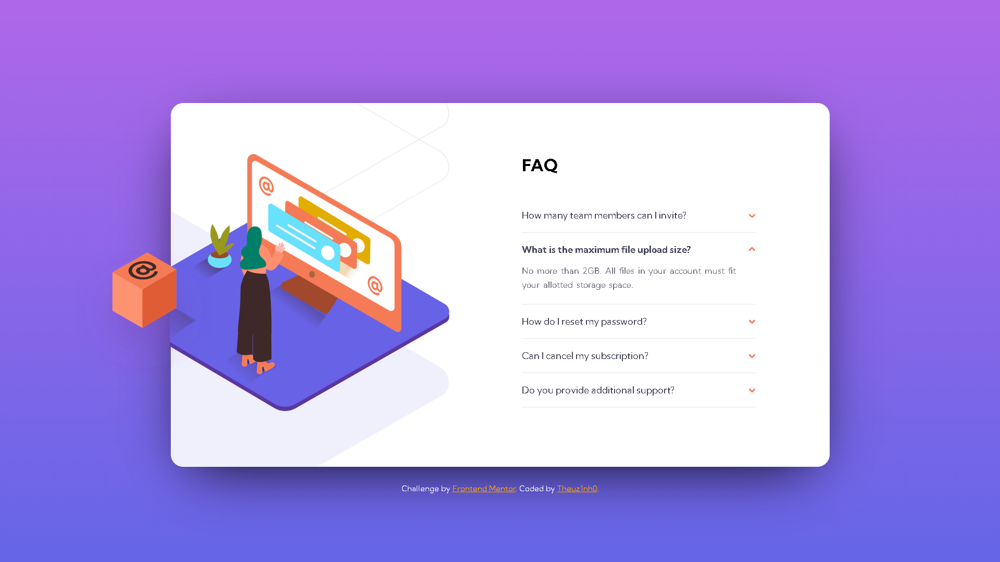

## Table of contents

- [Overview](#overview) 
  - [Screenshot](#screenshot)
  - [Links](#links)
- [My process](#my-process)
  - [Built with](#built-with)
  - [What I learned](#what-i-learned)
- [Author](#author)

## Overview

### Screenshot



### Links

- Solution URL: [Solution URL here](https://your-solution-url.com)
- Live Site URL: [Live Site URL here](https://theuz1nh0.github.io/FAQ-Accordion-Card/)

## My process

### Built with

- Semantic HTML5 markup
- Flexbox
- Mobile-first workflow


### What I learned

I learned to use the "overflow" CSS property and used JS and put into practice what little I've learned


```js
function listener(question, answer, span, height, questionContent) {
    question.addEventListener("click", () => {
        const styleConfirm = span.style.transform == "rotate(-180deg)";

        if (styleConfirm) {
            span.style.transform = "rotate(0)";
            question.style.overflow = "hidden";
            question.style.height = "3rem";
            answer.style.color = "hsl(240, 6%, 50%, 0)";
            questionContent.className = "question-content";
        } else {
            span.style.transform = "rotate(-180deg)";
            question.style.overflow = "visible";
            answer.style.color = "hsl(240, 6%, 50%)";
            question.style.height = height + "px";
            questionContent.className = "question-content-clicked";
        }

    })
}
```

## Author

- Linkedin - [Mateus Moura Domingos](https://www.linkedin.com/in/theuz1nh0/)
- Frontend Mentor - [@Theuz1nh0](https://www.frontendmentor.io/profile/Theuz1nh0)
